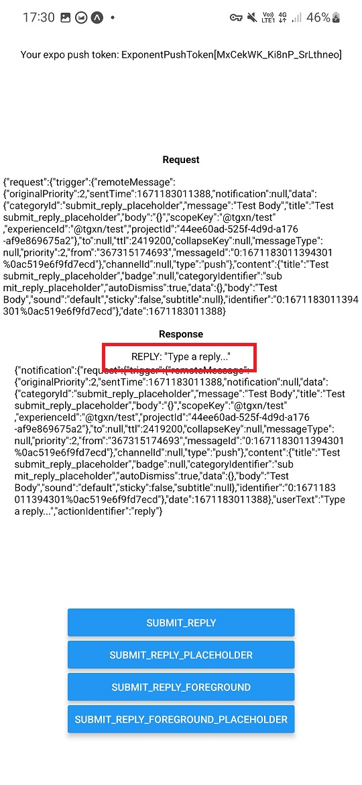

# Push Demo

Issue with Input Boxes on Android

[Example Git Repo](https://github.com/tgxn/expo-push-example)

[Here is this app, build with google services](https://expo.dev/accounts/tgxn/projects/test/builds/b987977d-eab9-4fd6-ae2e-34db5bcefbfa)


## Working Action:
### "submit_reply"

you can see the `notificationResponse.userText` [value](https://github.com/tgxn/expo-push-example/blob/main/App.js#L170) is filled

```js
{
    identifier: "reply",
    buttonTitle: "Reply",
    textInput: {
        submitButtonTitle: "Reply",
    },
    options: {
        opensAppToForeground: false,
    },
}
```


## None of these work:


### "submit_reply_placeholder"

here, the issue is the `notificationResponse.userText` value gets set to the valu eset in the placeholder.

```js
{
    identifier: "reply",
    buttonTitle: "Reply",
    textInput: {
        submitButtonTitle: "Reply",
        placeholder: "Type a reply...",
    },
    options: {
        opensAppToForeground: false,
    },
}
```



### "submit_reply_foreground"

here, `notificationResponse.userText` is never populated

```js
{
    identifier: "reply",
    buttonTitle: "Reply",
    textInput: {
        submitButtonTitle: "Reply",
    },
    options: {
        opensAppToForeground: true,
    },
}
```


### "submit_reply_foreground_placeholder",

here, `notificationResponse.userText` is never populated

```js
{
    identifier: "reply",
    buttonTitle: "Reply",
    textInput: {
        submitButtonTitle: "Reply",
        placeholder: "Type a reply...",
    },
    options: {
        opensAppToForeground: true,
    },
}
```


